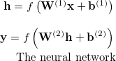

# My first neural network

This is my first neural network. I wanted it to be as simple as possible but still wanted to do something. So I went for the most simple [feedforward neural network]. Wikipedia does not make this clear but all it is is two lines...



The bold font signifies these matrices. The superscript in brackets is to signify both the **W**s and **b**s are different. Lower case bold fonts are vectors while uppercase bold fonts are matrices. The f is called the sigmoid function and make sure is the outputs are between zero and one.

For this application I used [Armadillo] Which takes care of all the vectors and matrices. That means in this C++ application it is still just two lines...

```C++
h_vec=sigmoid(W1*x_vec+b1_vec);
v_vec=sigmoid(W2*h_vec+b2_vec);
```

## What it does

It recognizes two words spoken by me, "on" and "off".

<video controls style="width:100%">
 <source src="https://raw.githubusercontent.com/jontio/Jvoice/master/assets/jvoiceH264.mp4" type="video/mp4">
Your browser does not support the video tag.
</video>

## Training

Training is the difficult thing with neural networks. I used Matlab to train it to my voice using snippets of audio of me saying  "on" and "off" That I cut and pasted together. I then exported the trained matrices so that the C++ program could import the matrices.

So using Matlab or Octave you should be able to do the same thing with your voice.


## Finally

Hopefully I'll write a little more about this later. Neural networks are fascinating as they seem almost alive. Watching my network learn was so awesome. I felt like a proud parent.

Jonti

[Feedforward neural network]: https://en.wikipedia.org/wiki/Feedforward_neural_network
[Armadillo]: http://arma.sourceforge.net/
